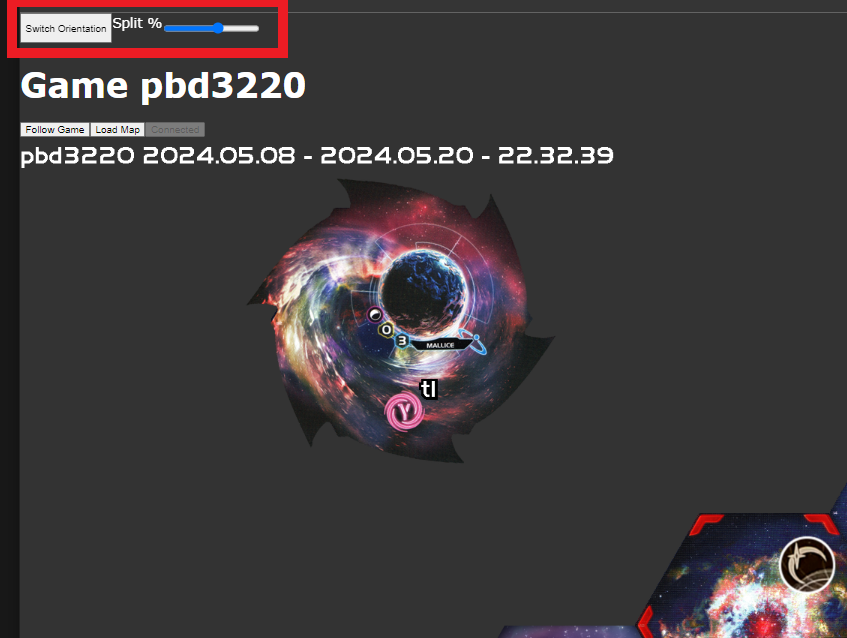

# TI Landscape Map Browser Extension

This open source browser extension allows you to view the Async TI4 map in traditional portrait or PC monitor friendly landscape.

## Installation Instructions

### Download the extension

### Unzip the download

Step 3: Unzip the download and put the folder somewhere you won't delete it

### Load the Extension:

#### For Chome

Step 6: Select the folder you just unzipped

#### For Firefox

- In the address bar, enter about:debugging#/runtime/this-firefox.
- Click “Load Temporary Add-on” and select your manifest.json file.

## Usage Instructions

In the top left corner of your browser during Async TI4 you will see a button "Switch Orientation" and a slider "Split %"

The button toggles between portrait and landscape layout. The slider adjusts the split point where the map horizontally meets the game overview. Adjust this slider to match your game (the preference is saved so you only need to do it once)

