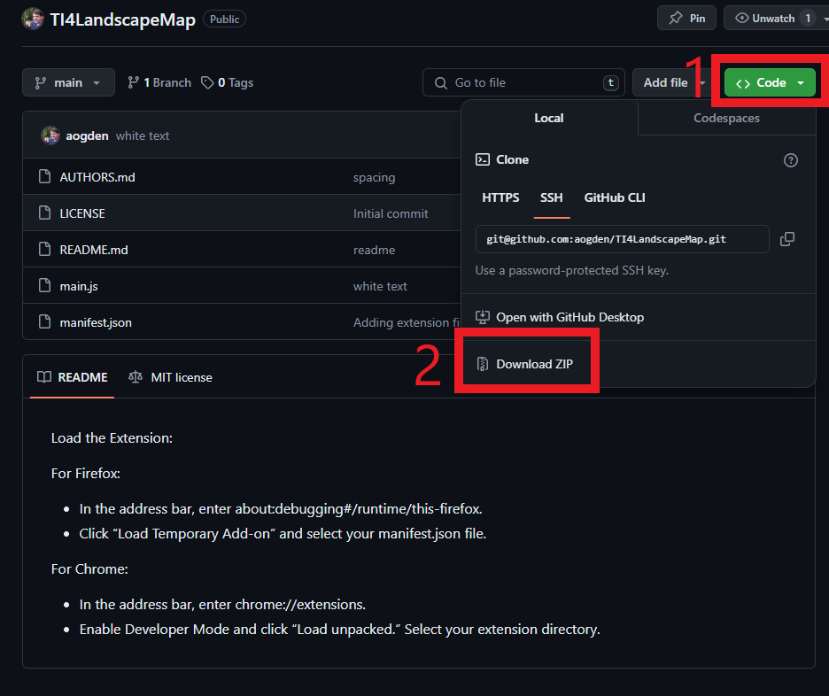
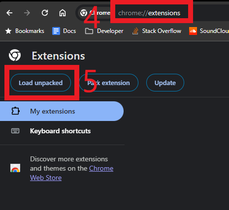

## Installation Instructions

### Download the extension

### Unzip the download

Step 3: Unzip the download and put the folder somewhere you won't delete it

### Load the Extension:

#### For Chome

Step 6: Select the folder you just unzipped

#### For Firefox

- In the address bar, enter about:debugging#/runtime/this-firefox.
- Click “Load Temporary Add-on” and select your manifest.json file.